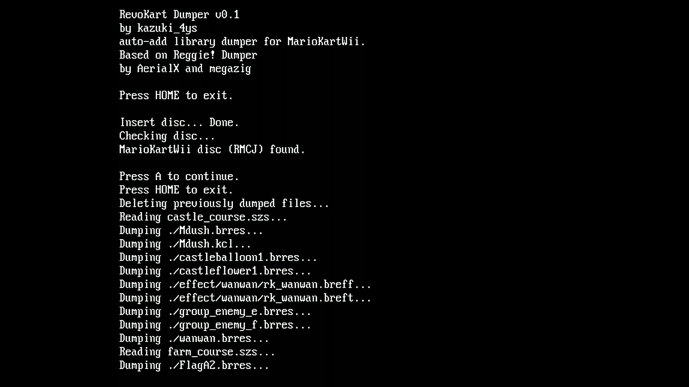

# RevoKart Dumper

 

## 説明

[WBZ/WLZ/WU8](https://wiki.tockdom.com/wiki/WBZ_%26_WLZ_(File_Formats))から[SZS](https://wiki.tockdom.com/wiki/SZS)の変換(または逆)に必要な`auto-add library`ディレクトリを直接ディスクからデータを読み取って作成するためのツール。

さらに、作成したフォルダを`auto-add.arc`というファイルにまとめる。

`auto-add.arc`のsha1ハッシュは`a4b2af6b878ee73928d463d5f088be6335af6f0e`になるはずである。(ならない場合はなにかしらダンプに失敗している。)

このツールはほとんど[Regggie! Dumper](https://github.com/Megazig/ReggieDumper)をベースに作成されている。

## Overview

This tool dumps the `auto-add library` needed for [WBZ/WLZ/WU8](https://wiki.tockdom.com/wiki/WBZ_%26_WLZ_(File_Formats)) decoding and encoding directly from the Mario Kart Wii disc. 

Based on [Regggie! Dumper](https://github.com/Megazig/ReggieDumper) by AerialX and [Megazig](https://github.com/Megazig/). 

The dumped files are stored in `sd:/rk_dumper/auto-add` and `sd:/rk_dumper/auto-add.arc` as an archive.

The sha1 hash of `auto-add.arc` should be `a4b2af6b878ee73928d463d5f088be6335af6f0e`.

## Credit

* [Regggie! Dumper](https://github.com/Megazig/ReggieDumper) by AerialX and [Megazig](https://github.com/Megazig/).

* [Yaz0 decompress code](https://wiki.tockdom.com/wiki/YAZ0_(File_Format)#Decompression) by [Wiimm](https://wiki.tockdom.com/wiki/Wiimm)